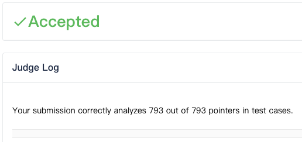

  

## Tai-e Assignments for Static Program Analysis

### Getting Started

If you want to do the assignments, please start with "*Overview of Tai-e Assignments*" [[中文](https://tai-e.pascal-lab.net/intro/overview.html)][[English](https://tai-e.pascal-lab.net/en/intro/overview.html)].

---

Completed assigment 1~6

